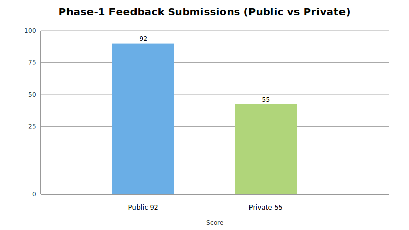
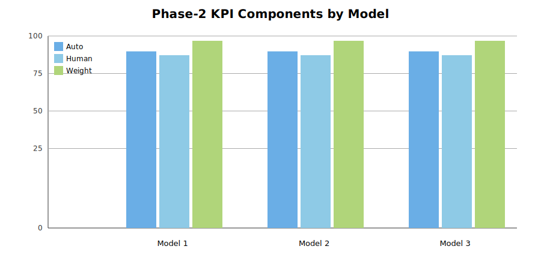
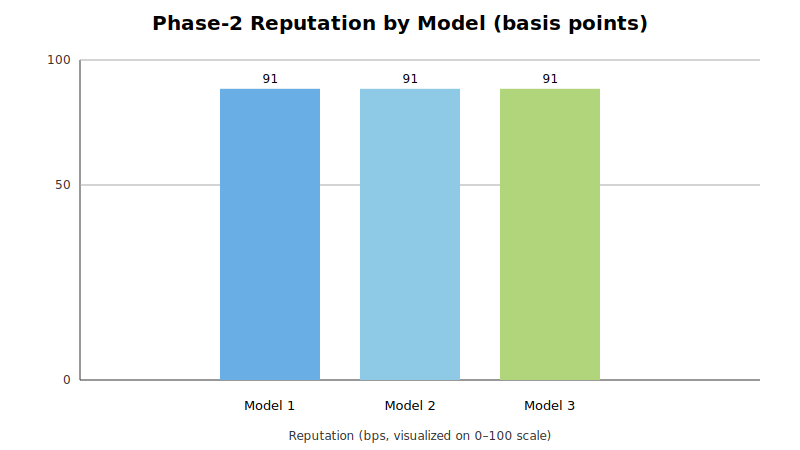

# ZKTrustLLM – Demo Figures & Tables

This page hosts the figures and tables used in the Phase-1 and Phase-2 demo (local Hardhat/Truffle testnet).

## Phase-1 Feedback (Public vs Private)

**Table (CSV)**: [`phase1_feedback.csv`](assets/phase1_feedback.csv)

Notes:
- 2 submissions: 92 (public) and 55 (private)
- Script-reported: `reputationSum = 92`, `feedbackCount = 2`, `average x100 = 4600`

## Phase-2 KPIs (3 models)

**Grouped KPI components (Auto/Human/Weight):**

**Reputation (basis points) by model:**

**Table (CSV)**: [`phase2_models.csv`](assets/phase2_models.csv)

Evidence URI for all three:

## One-line citation for paper

“Demo figures and raw tables are available at:
`https://github.com/Sudarson2021/zktrustllm-phase1/tree/demo-artifacts/docs`
(see `docs/assets`).”
